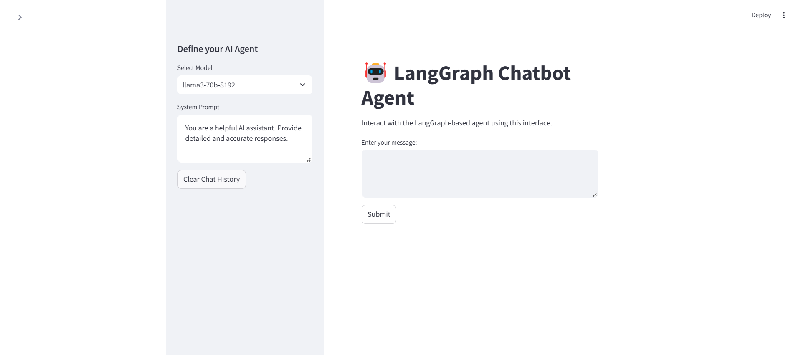

# 🤖 NeuroPilot - LangGraph Chatbot Agent

<div align="center">
  
  <p><em>NeuroPilot - A Powerful Conversational AI Interface</em></p>
</div>

<p align="center">
  
  
  
  
</p>

## 📌 Table of Contents
- [Overview](#-overview)
- [Features](#-features)
- [Prerequisites](#-prerequisites)
- [Installation](#-installation)
- [Project Structure](#-project-structure)
- [Configuration](#-configuration)
- [Usage](#-usage)
- [API Documentation](#-api-documentation)
- [Contributing](#-contributing)
- [License](#-license)
- [Acknowledgements](#-acknowledgements)

## 🎯 Overview
NeuroPilot - LangGraph Chatbot Agent is a sophisticated AI-powered conversational interface that combines the power of LangGraph, FastAPI, and Streamlit. It provides an intuitive platform for interacting with advanced language models while offering customizable prompts and model selection capabilities.

## 🌟 Features
- **Advanced Language Models**
  - Support for llama3-70b-8192
  - Support for mixtral-8x7b-32768
  - Easily extendable to other models

- **Interactive UI Components**
  - Model selection dropdown
  - Customizable system prompts
  - Clear chat history function
  - Real-time conversation interface

- **Robust Backend**
  - FastAPI-powered backend
  - Efficient state management
  - Integrated error handling
  - RESTful API architecture

- **Search Capabilities**
  - Integrated Tavily search
  - Real-time information retrieval
  - Contextual search results

## 📋 Prerequisites
- Python 3.9+
- GROQ API key
- Tavily API key
- Git (for version control)

## 🚀 Installation

1. **Clone the Repository**
```bash
git clone https://github.com/Manish-Kumar24/NeuroPilot-RAG.git
cd NeuroPilot-RAG
```

2. **Create Virtual Environment**
```bash
python -m venv venv

# Windows
venv\Scripts\activate

# macOS/Linux
source venv/bin/activate
```

3. **Install Dependencies**
```bash
pip install -r requirements.txt
```

4. **Configure Environment Variables**
Create a `.env` file in the root directory:
```env
GROQ_API_KEY=your_groq_api_key_here
TAVILY_API_KEY=your_tavily_api_key_here
```

5. **Start the Application**
```bash
# Terminal 1 - Start Backend
python run.py

# Terminal 2 - Start Frontend
streamlit run frontend/app.py
```

## 📁 Project Structure
```
NeuroPilot-RAG/
├── backend/
│   ├── __init__.py
│   ├── main.py         # FastAPI backend server
│   └── config.py       # Configuration settings
├── frontend/
│   ├── __init__.py
│   └── app.py          # Streamlit frontend
├── images/             # Screenshots and images
├── requirements.txt    # Project dependencies
├── run.py             # Server startup script
└── README.md          # Project documentation
```

## ⚙️ Configuration

### Environment Variables
- `GROQ_API_KEY`: Your GROQ API key
- `TAVILY_API_KEY`: Your Tavily API key

### Available Models
- llama3-70b-8192
- mixtral-8x7b-32768

### System Settings
- Backend Port: 8000
- Frontend Port: 8501
- Host: 127.0.0.1

## 💻 Usage

1. **Access the Interface**
   - Open your browser and navigate to `http://localhost:8501`
   - You'll see the interface as shown in the screenshot above

2. **Configure the Agent**
   - Select your preferred model from the dropdown
   - Customize the system prompt if needed
   - Use "Clear Chat History" to reset the conversation

3. **Start Chatting**
   - Enter your message in the text area
   - Click "Submit" to send
   - View the AI's response in real-time

## 📚 API Documentation

### Backend Endpoints

1. **Root Endpoint**
```http
GET /
Response: {"status": "online", "message": "LangGraph Agent API is running"}
```

2. **Chat Endpoint**
```http
POST /chat
Body: {
    "messages": List[str],
    "model_name": str,
    "system_prompt": str
}
Response: {
    "messages": [
        {"type": "ai", "content": str}
    ]
}
```

## 🤝 Contributing

1. Fork the repository
2. Create your feature branch (`git checkout -b feature/AmazingFeature`)
3. Commit your changes (`git commit -m 'Add some AmazingFeature'`)
4. Push to the branch (`git push origin feature/AmazingFeature`)
5. Open a Pull Request

## 📄 License
This project is licensed under the MIT License - see the [LICENSE](LICENSE) file for details.

## 🙏 Acknowledgements
- [LangGraph](https://github.com/langchain-ai/langgraph)
- [FastAPI](https://fastapi.tiangolo.com/)
- [Streamlit](https://streamlit.io/)
- [GROQ](https://groq.com/)
- [Tavily](https://tavily.com/)

---

<div align="center">
  <p>Made with ❤️ by Manish Kumar</p>
  <p>
    <a href="https://github.com/Manish-Kumar24">GitHub</a> •
    <a href="mailto:manishkumar202209@gmail.com">Email</a>
  </p>
</div>